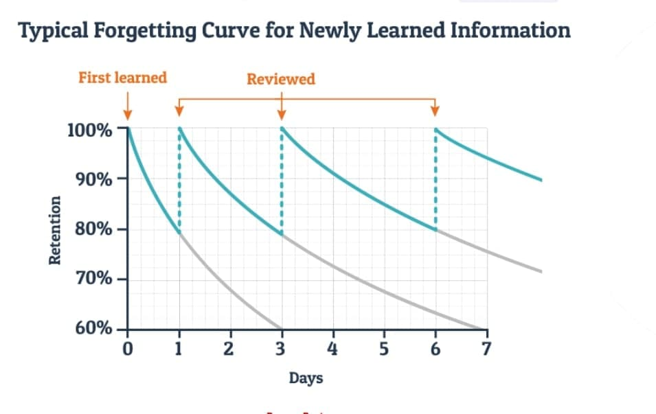

# Study Tracker app
A simple app to track your study and review the read materials without forgetting it.

Based on the above diagram, we need to review anything we learned exponentially to keep the high retention. Since remembering the days to review might be challenging to remember when we tackle lots of subjects to learn, I've decided to write a simple code to make it easy for us.

